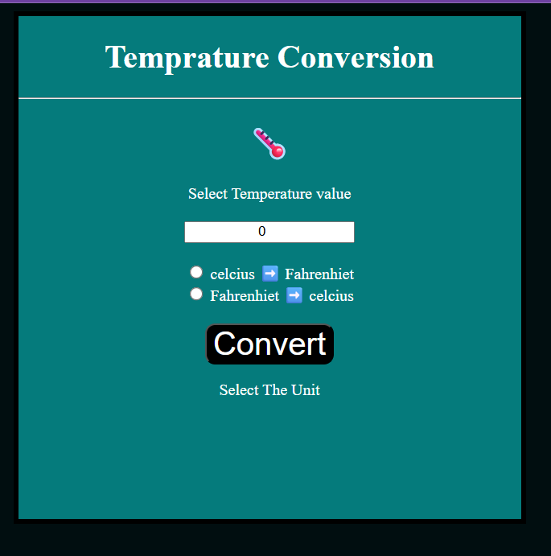
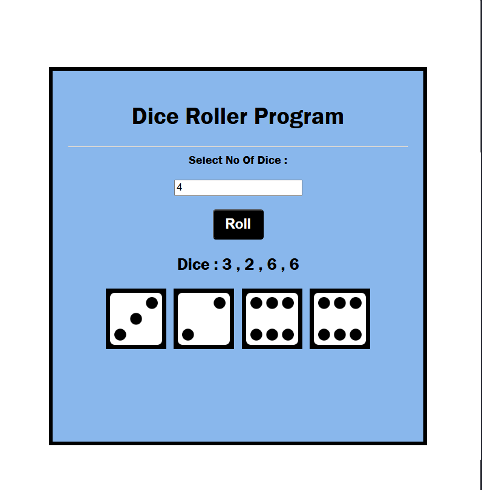

# 🚀 Web Development Small Projects

Welcome to my small web development projects repository!  
This repository contains mini frontend and JavaScript practice projects that I build while learning and improving my web development skills.

---

## 📂 Projects Included

### 🎯 Guess The Number Game
A simple game where the user tries to guess the correct number.

### 🔢 Random Number Generator
Generates random numbers using JavaScript.

### 🌡️ Temperature Conversion
Convert temperature values between Celsius, Fahrenheit, and Kelvin.

### 📘 Basics of JavaScript
Small JavaScript practice programs covering basic concepts.

---

## 🛠️ Technologies Used

- HTML5
- CSS3
- JavaScript (ES6)

---

## 🎯 Purpose of This Repository

These projects are created for:
- Practicing JavaScript concepts
- Improving DOM manipulation skills
- Building frontend development experience
- Learning through small real-world projects

---
## 📸 Website Preview

## 🌐 Website Preview

 

---
## 📈 Future Updates

More mini projects and practice exercises will be added regularly as I continue my web development journey.

---

## 👨‍💻 Author

YugMathur05
# YugMathur05-Web_Development_Small_Projects
